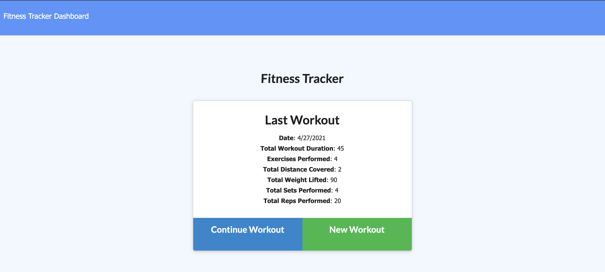
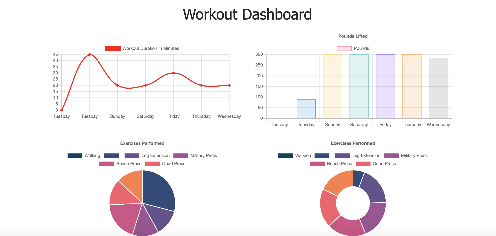
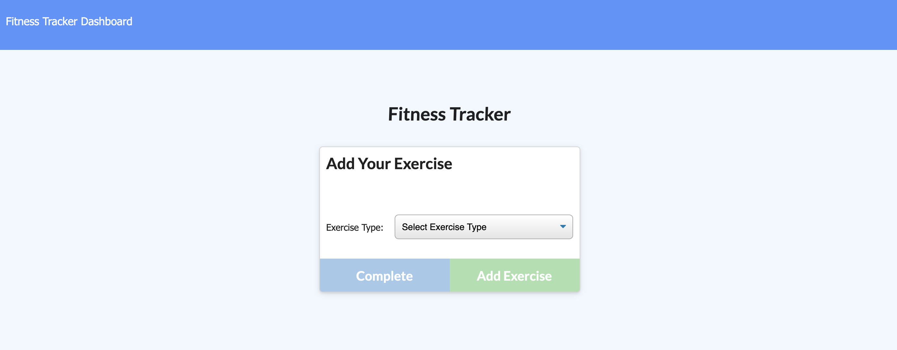

  # Fitness Tracker 

   
  This application allows user to manage their workout routines with simple functionnality. User can add and update exercises and their components. 

   

   [Deployed last version](https://thawing-cove-82739.herokuapp.com/?id=6088f010694970001552a3ae)

   [Github repo](https://github.com/Amal31497/Fitness-Tracker)

   

  ## Table of Contents 
 
  ##### * [Technologies used](#Technologies)
  ##### * [Usage walkthrough](#Walkthrough)
  ##### * [Installation](#Installation)
  ##### * [Credits](#Credits)
  ##### * [License](#License)
  ##### * [Contact Info](#Contact)

  ## Technologies:
   _*HTML,CSS,Javascript,Node.js,Heroku App,Others*_

  ## Walkthrough:
  #### Video:
  Please follow this *[link](https://youtu.be/mi_VH6nHyX4)* to watch the walkthrough video.

  #### Screenshots:
  
  
  

  ## Installation:
  Run the following commands in your integrated terminal to initalize the application:
  
  No Installation required for this app!
  
  ## Credits:
  [w3schools.com](w3schools.com)
  [MDN](MDN)

  ## License: 

  ##### Copyright: Amal Janabayev

  ##### 

  ##### [License Link](https://www.gnu.org/licenses/gpl-3.0.en.html)

  ## Contact: 

  ##### amalj2426@gmail.com